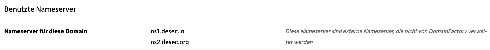

# Synology/Mac Custom Domain updater for Dynamic IP addresses

This is a handy little bash script to dynamically update DNS entries for your custom domains you want to point to your Synology NAS when you do not have a static IP.

## This is for you, if

- You own 1..n domains and
- Want to host the contents behind them on top level on you Synology NAS
- Your Synology NAS sits behind a router that has a dynamic IP which your ISP changes (usually once / 24h)

*Example*: You own the domain example.com and want to host your wordpress site on you Synology NAS, making it available at <https://example.com>

*Remark*: If you only want to use subdomains (e.g. photos.example.com) you can do this easier with CNAME records that point to a DynDNS domain. A-records for the domain itself are not allowed to be CNAMES. Thus, the dynamic update of the A-records is required.

## Prerequisites

### DNS Service that allows for dynamic updating

If you are at a "typical" hoster, like [domainfactory.eu], they will not offer the chance to dynamically update your URL's A or AAAA records with an API. However, *DESEC* ([desec.io]) allows this. All you need to do is create an entry in your hoster's nameserver settings that determines the DESEC-nameservers to be used whenever your domain is being resolved.

At Domainfactory, the menu is *Nameserver Settngs* and the nameservers to be configured are the following:



So steps you need to do are

1. Configure your hoster's nameserver settings so that the DESEC nameservers are used
2. Configure your URL in your DESEC account

### Preparations on your Synology NAS

*Remark*: Tested with Synology DSM 7.2.1

- Enable SSH access in Control Center -> Terminal & SNMP
- Install the DNS Server package

### Deploy the Script

Copy the 2 script files to your Synology NAS. You can do this via drag & drop from the Browser UI.

Adapt the Config-Parameters in the `config.sh` file.

Somewhere in your user's home directory is fine, e.g. `~/url_update/`.

Log in to your Synology NAS via SSH.

Make sure, the `DynDNS_Update.sh` is executable. If it is not, make it executable with: `chmod +x DynDNS_Update.sh`

### Edit your Synology's Crontab

To make sure, the script checks for a change in your external IPs on a regular basis, you need to schedule the execution in your Synology's crontab.

Connect to your Synology NAS via SSH.

Edit the /etc/crontab file using a text editor like nano or vi (you need administrator privileges): `sudo vi /etc/crontab`

## What the script does

The script contains of 2 parts: The `DynDNS_Update.sh` contains the script logic and the `config.sh` contains the custom paramaters to be configured.

### Config Parameters

The `config.sh` files has to be located in the same directory as the script itself. It contains your DESEC-token which you need to generate here [https://desec.io/tokens] which serves as your authentication and authorization against the DESEC update endpoint.

```bash
TOKEN="yourDESEC_TokenValue"
DOMAINS=(domain1 domain2 ...)
OLD_IPv4="0.0.0.0"
OLD_IPv6="::::::"
```

The last two variables store the IP addresses from the last script execution to be compared to the external addresses in the next execution.

### Determining your external IP addresses

After reading the `config.sh` file the script has a check on which operation system it runs, as the commands to determine your external IP address differ depending on the platform you are on.

If you are on a Mac (`Darwin`-Kernel operating system) you have the `dig` command available natively. On the Synology NAS you can also use dig, but only if you have the DNS server package installed, as it comes as a utility function with this package.

The following block of code determines, which OS you are on and then uses the Google request DNS resolver to determine your external IP.

```bash
if [[ $(uname) == "Darwin" ]]; then
    # Code specific to macOS --> dig is available
    ipv4=$(echo "$(dig -4 TXT +short o-o.myaddr.l.google.com @ns1.google.com)" | sed 's/^"//; s/"$//')
    ipv6=$(echo "$(dig -6 TXT +short o-o.myaddr.l.google.com @ns1.google.com)" | sed 's/^"//; s/"$//')
    echo "This code runs on macOS."
elif [[ $(uname) == "Linux" ]]; then
    # Code specific to Syno-DSM --> dig binary taken from the DNS Server package
    ipv4=$(echo "$(/var/packages/DNSServer/target/bin/dig -4 TXT +short o-o.myaddr.l.google.com @ns1.google.com)" | sed 's/^"//; s/"$//')
    # Remember: Enable IPv6 on Synology in the Network --> Network Interface --> Manage section first
    ipv6=$(echo "$(/var/packages/DNSServer/target/bin/dig -6 TXT +short o-o.myaddr.l.google.com @ns1.google.com)" | sed 's/^"//; s/"$//')
    echo "This code runs on SynoDSM"
else
    # Code for other operating systems (optional)
    echo "This code runs on an unknown operating system."
    exit 1
fi
```

### Sanity Checks

If the IP addresses have not changed compared to the values stored in the `config.sh`, the script will exit.

If the external IP addresses could not be properly determined and are empty, the script will exit.

### Execute the Update via API

With the collected parameters the proper URL for the DESEC update API is constructed for every domain given in the `$DOMAINS`-array in the `config.sh`. The update is performed for every URL given.

### Store values in Config-file

Lastly, the IP addresses in the `config.sh` are being updated.

## Create Cron-Task

Connect to your Synology NAS via SSH.

Edit the /etc/crontab file using a text editor like nano or vi: `sudo vi /etc/crontab`

*Note: Using sudo is important as the crontab file requires root privileges for modification.*

Add a new line to the file with the following format:

`*/5 *   *   *   *   your_username   cd ~/url_update/ ./DynDNS_Update.sh`

This line

- runs every 5 minutes
- under the user identity given in `your_username`
- sets the working directory to the directory where you copied the script files (e.g. `~/url_update/`)
- defines the script to be executed

After your edited the crontab, restart the cron service: `sudo systemctl restart crond`
